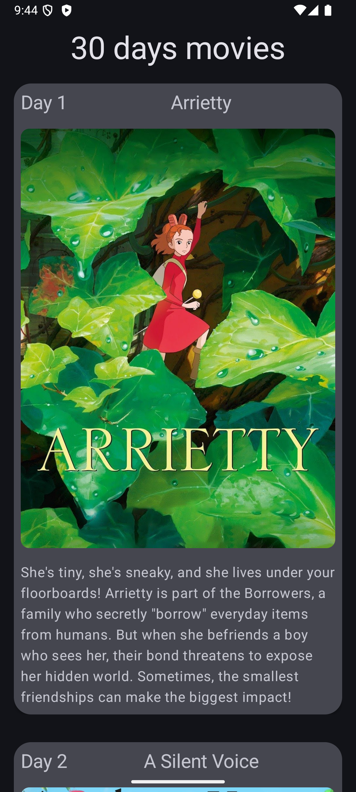

# 🎬 30 Days of Movies - Jetpack Compose App

## 📌 **Overview**
This is a **Jetpack Compose** Android app that displays **30 days of movies** in a scrollable list. Users can **click on a card** to expand additional details about the movie. The app features **smooth animations**, **lazy loading**, and a **modern Material 3 design**.

---

## 🚀 **Features**
✅ Displays a list of movies in a **LazyColumn**  
✅ **Animated entrance** of movie items using `AnimatedVisibility`  
✅ **Expandable** movie cards on click  
✅ **Smooth transitions** with `animateContentSize()`  
✅ Material 3 **Theming & UI Components**

---

## 📸 **Screenshots**
📷 

---

## 🛠 **Technologies Used**
- **Kotlin** - Main programming language
- **Jetpack Compose** - UI toolkit
- **Material 3** - Modern UI design
- **LazyColumn** - Efficient list rendering
- **Animations API** - For smooth UI interactions

---

## 🔨 **Installation & Setup**
1. **Clone the Repository**
   ```sh
   git clone https://github.com/your-username/your-repo-name.git
open and run in android studio 
---

